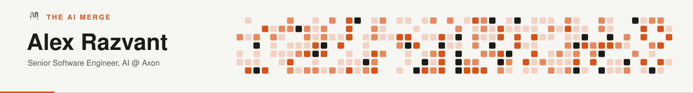

<!--
  README for github.com/arazvant
  Palette pulled directly from theaimerge.com: cream #F8F6F2, charcoal #1C1B19,
  terracotta #D95319, peach highlight #F3D2C4, muted gray #A09F9A.
  assets/header.svg and assets/footer.svg are hand-built, self-hosted SVGs
  (no third-party generator) using the real logo mark from theaimerge.com.
  PLACEHOLDER: drop a headshot at assets/profile-photo.png (~300x300px) to fill that slot below.
-->

  

 

## About

<table>
<tr>
<td width="112" valign="top">
<!-- PLACEHOLDER: headshot — drop a photo at assets/profile-photo.png -->

</td>
<td valign="top">
Nearly a decade across software, machine learning, deep learning, and computer vision — from publishing perception research to running AI systems in production. I care about what happens <b>after</b> the demo: data, scale, infrastructure, reliability, and how systems actually fail once real users show up.
</td>
</tr>
</table>

<table width="100%">
<tr>
<td width="48" valign="top"><b>01</b></td>
<td valign="top"><b>AI Researcher</b> — 3D world modeling &amp; perception for autonomous vehicles, published research (2020)</td>
</tr>
<tr>
<td valign="top"><b>02</b></td>
<td valign="top"><b>Computer Vision Engineer</b>, Everseen · 4 yrs — in-store vision systems, model training, MLOps end-to-end</td>
</tr>
<tr>
<td valign="top"><b>03</b></td>
<td valign="top"><b>Senior Software Engineer I, AI</b>, Axon · current — large-scale Vision AI &amp; Vision-Language Model systems</td>
</tr>
<tr>
<td valign="top"><b>04</b></td>
<td valign="top"><b>Founder &amp; Writer</b>, The AI Merge · current — teaching production AI engineering, NVIDIA content partner</td>
</tr>
</table>

 

<table width="100%">
<tr align="center">
<td width="25%"><h2>10,000+</h2>Newsletter subscribers</td>
<td width="25%"><h2>576+</h2>Stars on Kubrick</td>
<td width="25%"><h2>~9</h2>Years in AI &amp; CV</td>
<td width="25%"><h2>1</h2>NVIDIA partnership</td>
</tr>
</table>

 

## The AI Merge

*Less hype. More engineering.* A technical publication for engineers designing, building, and deploying production AI systems — grew from ~300 to 10,000+ subscribers.

- Official **NVIDIA content partner** — tutorials on CUDA, TensorRT, NIM, and RTX; recipient of an NVIDIA DGX Spark
- Co-created **[Kubrick](https://github.com/the-ai-merge/multimodal-agents-course)**, an open-source multimodal AI agent course with Miguel Otero Pedrido
- Building **The AI Atlas** — a 220+ slide visual guide to the AI stack: hardware, training, inference, agents, deployment
- Publishing on **[YouTube](https://www.youtube.com/@theaimerge)** — system design walkthroughs and live coding

**[read.theaimerge.com →](https://read.theaimerge.com)** &nbsp;·&nbsp; **[theaimerge.com →](https://theaimerge.com)**

 

## Featured Projects

<table width="100%">
<tr>
  <td width="65%"><a href="https://github.com/the-ai-merge/multimodal-agents-course"><b>Kubrick — Multimodal Agents Course</b></a> An MCP multimodal AI agent with eyes and ears, co-built with Miguel Otero Pedrido.</td>
  <td align="right"></td>
</tr>
<tr>
  <td><a href="https://github.com/the-ai-merge/production-hub"><b>Production Hub</b></a> Hands-on techniques to optimize and serve AI models to production.</td>
  <td align="right"></td>
</tr>
<tr>
  <td><a href="https://github.com/the-ai-merge/computer-vision-hub"><b>Computer Vision Hub</b></a> Building Computer Vision &amp; Deep Learning solutions on video/image data.</td>
  <td align="right"></td>
</tr>
<tr>
  <td><a href="https://github.com/theaimerge/ai-programming-hub"><b>AI Programming Hub</b></a> Experimenting with C++, CUDA, Rust, and OpenAI Triton for ML performance.</td>
  <td align="right"></td>
</tr>
</table>

 

## Tech Stack

**Languages**
 

**AI / ML / Vision**
 

**LLM Systems / Agents / Inference**
 

**Serving, Infra &amp; Data**
 

**Web**
 

 

## Connect

  

 
 

## GitHub Activity

<picture>
  <source media="(prefers-color-scheme: dark)" srcset="https://raw.githubusercontent.com/arazvant/arazvant/output/dist/snake-dark.svg" />
  <source media="(prefers-color-scheme: light)" srcset="https://raw.githubusercontent.com/arazvant/arazvant/output/dist/snake-light.svg" />
  
</picture>

&nbsp;

 

  

