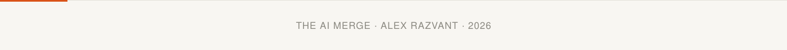

<!--
  README for github.com/arazvant
  Palette from theaimerge.com: cream #F8F6F2, charcoal #1C1B19, terracotta #D95319.
  assets/header.svg and assets/footer.svg are hand-built — an animated grid of squares,
  styled like a GitHub contribution graph, sweeping in left-to-right in brand colors.
  Self-hosted, no third-party generator. Bump the ?v= query on header.svg after edits —
  raw.githubusercontent.com caches aggressively and won't otherwise pick up changes.
  PLACEHOLDER: drop a headshot at assets/profile-photo.png to fill that slot below.
-->

  

  

 

I'm Alex — a software engineer who ended up spending most of the last decade on AI: perception research for autonomous vehicles, in-store computer vision at Everseen, and now Vision AI and VLM systems at Axon. Somewhere in between I've touched most of the stack — training, edge inference, agents, MLOps, LLMOps — because the roles kept pulling me into whatever the system actually needed next.

The rest of my time goes into **[The AI Merge](https://theaimerge.com)**, where I write and teach the engineering that happens after the demo — the part most AI content skips. It's grown to 10,000+ engineers, turned into an NVIDIA content partnership, and is where I'm building courses and a visual guide to the field.

 

**How I work:** systems over demos. On AI-assisted coding specifically — I plan, I approve, agents execute inside that scope; I don't hand over the wheel. I'd rather ship something small end-to-end than leave three things half-built. And I try to teach whatever I just learned, in public, while it's still fresh.

 

### What I'm building

<table width="100%">
<tr><td width="60%"><a href="https://github.com/the-ai-merge/multimodal-agents-course"><b>Kubrick</b></a> — open-source multimodal AI agent course, built with Miguel Otero Pedrido</td><td align="right"></td></tr>
<tr><td><b>MAVS</b> — edge multi-agent vision system for wildlife conservation: MLOps, MCP/A2A agents, edge inference</td><td align="right">private</td></tr>
<tr><td><b>Forge</b> — a human-gated workflow for building software with AI agents: you approve, agents execute in scope</td><td align="right">private</td></tr>
<tr><td><b>Patch</b> — a local voice companion / desk assistant running on an NVIDIA DGX Spark, with an iPhone as its mic, display, and approval surface</td><td align="right">private</td></tr>
<tr><td><a href="https://github.com/the-ai-merge/production-hub"><b>Production Hub</b></a> — techniques for optimizing and serving models in production</td><td align="right"></td></tr>
<tr><td><a href="https://github.com/the-ai-merge/computer-vision-hub"><b>Computer Vision Hub</b></a> — CV &amp; deep learning on video/image data</td><td align="right"></td></tr>
<tr><td><a href="https://github.com/theaimerge/ai-programming-hub"><b>AI Programming Hub</b></a> — C++, CUDA, Rust, and OpenAI Triton experiments</td><td align="right"></td></tr>
</table>

 

### The AI Ecosystem

A map of where I actually work across the stack — not a skills checklist, closer to the six-layer breakdown I teach in The AI Merge.

**Foundations**

<table>
<tr>
<td align="center"></td>
<td align="center"></td>
<td align="center"></td>
<td align="center"></td>
<td align="center"></td>
<td align="center"></td>
<td align="center"></td>
<td align="center"></td>
<td align="center"></td>
<td align="center"></td>
</tr>
</table>

**Systems — agents, RAG & multimodal**

<table>
<tr>
<td align="center"></td>
<td align="center"></td>
<td align="center"></td>
<td align="center"></td>
<td align="center"></td>
<td align="center"></td>
<td align="center"></td>
<td align="center"></td>
<td align="center"></td>
<td align="center"></td>
</tr>
</table>

**Deployment & infrastructure**

<table>
<tr>
<td align="center"></td>
<td align="center"></td>
<td align="center"></td>
<td align="center"></td>
<td align="center"></td>
<td align="center"></td>
<td align="center"></td>
<td align="center"></td>
<td align="center"></td>
<td align="center"></td>
</tr>
</table>

**Evaluation & monitoring**

<table>
<tr>
<td align="center"></td>
<td align="center"></td>
<td align="center"></td>
<td align="center"></td>
<td align="center"></td>
<td align="center"></td>
</tr>
</table>

**Compute & optimization**

<table>
<tr>
<td align="center"></td>
<td align="center"></td>
<td align="center"></td>
<td align="center"></td>
<td align="center"></td>
<td align="center"></td>
<td align="center"></td>
</tr>
</table>

**AI-assisted engineering**

<table>
<tr>
<td align="center"></td>
<td align="center"></td>
<td align="center"></td>
<td align="center"></td>
<td align="center"></td>
<td align="center"></td>
</tr>
</table>

 

### The AI Merge

*Less hype. More engineering.* I write and teach production AI engineering — what happens after the demo, when data, scale, and reliability start to matter.

- Grew from ~300 to 10,000+ subscribers in a year
- NVIDIA content partner — tutorials on CUDA, TensorRT, NIM, RTX; recipient of an NVIDIA DGX Spark
- Building **The AI Atlas**, a 220+ slide visual guide to the AI stack, plus workshops and courses — all still taking shape

 

### Connect

  

[X](https://twitter.com/RazvantAlexand) · [Substack](https://read.theaimerge.com) · [YouTube](https://www.youtube.com/@theaimerge) · [GitHub Org](https://github.com/the-ai-merge)

 

<picture>
  <source media="(prefers-color-scheme: dark)" srcset="https://raw.githubusercontent.com/arazvant/arazvant/output/dist/snake-dark.svg" />
  <source media="(prefers-color-scheme: light)" srcset="https://raw.githubusercontent.com/arazvant/arazvant/output/dist/snake-light.svg" />
  
</picture>

  

