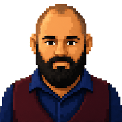

<!--
  README for github.com/arazvant
  Palette from theaimerge.com: cream #F8F6F2, charcoal #1C1B19, terracotta #D95319.
  assets/header.svg and assets/cta-banner.svg are hand-built — the header is an animated
  grid of squares, styled like a GitHub contribution graph, sweeping in left-to-right in
  brand colors. Self-hosted, no third-party generator. Bump the ?v= query after edits —
  raw.githubusercontent.com caches aggressively and won't otherwise pick up changes.
  assets/profile-photo.gif is the pixel-portrait GIF, resampled to 5fps.
  assets/stack-*.svg are the tech-stack tile grids — every tile the same size,
  charcoal on cream, real logos pulled from simple-icons (and devicon where
  simple-icons has no entry) via jsDelivr.
  Regenerate with: python3 assets/gen_stack.py (edit the lists in there).

  Page flow: Who am I -> What I do -> Why follow -> CTAs -> Connect -> (activity)
-->

  

  

 

## Who am I
<table>
<tr>
<td></td>
<td>I'm Alex - a Senior Software Engineer who spent a decade in AI. I also create content through The AI Merge, sharing the lessons I've learned.</td>
</tr>
</table>

## What I do

Building and teaching production AI systems - through The AI Merge.

**At Axon**

- Built the OS-to-cloud stack for a fleet of thousands of edge devices (NVIDIA Jetson, Raspberry Pi, embedded Linux) — Wind River Linux images, RAUC for A/B OTA updates, and AWS IoT Core / Device Shadows for fleet configuration and telemetry.
- Shipped a fully on-edge DeepStream AI pipeline on Jetson — optimized models and an expert system, wired into the edge-AI service stack to stream results to the cloud. Also designed a dynamic tiered config system pushed to devices as heartbeats over IoT Device Shadows.
- Built AI pipelines analyzing video at scale — semantic video search, image captioning, video summarization, and synthetic data generation for training, served through Triton inference on edge devices and in Kubernetes.
- Helped build Search: ~25 microservices spanning multiple clouds, ingesting device data into a large-scale search and filtering layer that holds a low p99 under load.
- Built agentic systems for on-call and incident management — coding-agent workflows and agents that triage production traces.
- Pushes internally for better AI-assisted engineering: knowledge sharing, tutorials, and workshops on using AI well as an engineer.

<table width="100%">
<tr><td width="60%"><a href="https://github.com/the-ai-merge/multimodal-agents-course"><b>Kubrick</b></a> — an MCP-based multimodal AI agent with eyes and ears: vision, voice, and memory in one open-source course, built with Miguel Otero Pedrido</td><td align="right"></td></tr>
<tr><td><b>MAVS</b> — edge multi-agent vision system for wildlife conservation: an MLOps pipeline trains the CV models, then an MCP/A2A agentic layer runs them at the edge</td><td align="right">Soon</td></tr>
<tr><td><b>Forge</b> — a human-gated SDLC for building with AI agents: you grill the spec, design, and plan; agents execute inside that scope through implement, review, and ship</td><td align="right">Soon</td></tr>
<tr><td><b>Patch</b> — a local voice companion on an NVIDIA DGX Spark, with an iPhone as its mic and display: captures notes into Obsidian, runs Todoist, and handles daily focus/review routines</td><td align="right">Soon</td></tr>
</table>

I like to think about Software and AI grouped in three ladders, which is the way I also teach it.

**Foundations**

**Systems**

**Engineering**

 

## Why follow

*We need less hype. More engineering.* If you're a software engineer trying to actually understand AI, not just call an API, here's what's in it for you:

- **[The AI Merge](https://theaimerge.com)** — field notes and deep dives on production AI systems, no prompt lists. Grew from ~300 to 10,000+ subscribers in a year.
- Early access to **The AI Atlas**, a 220+ slide visual guide to the whole AI stack — hardware, training, inference, agents, deployment
- An **NVIDIA content partnership** — tutorials on CUDA, TensorRT, NIM, RTX, plus hardware access via an NVIDIA DGX Spark
- A **YouTube channel** with system-design walkthroughs and live coding, not tutorials that stop at "hello world"

 

---

<table align="center" width="100%">
<tr>
<td width="25%" align="center"></td>
<td width="25%" align="center"></td>
<td width="25%" align="center"></td>
<td width="25%" align="center"></td>
</tr>
</table>

 

## Connect

 

<!-- 

 -->

 

  

